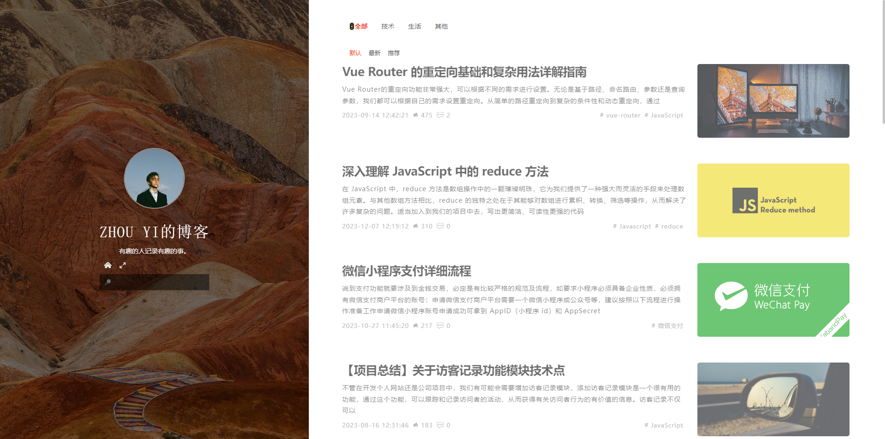

# 个人博客主页 Nuxt3

#### 介绍

✨2024最新个人博客主页基于 Vue3、Nuxt3、Javascript、Pinia搭建 。可扩展公司官网、产品展示、在线简历...




#### 环境

```shell
 Node.js >= 18.0.0

 #搭建时环境
 Node.js = 20.0.0
 npm = 10.2.0
 nuxt = 3.0.0-rc.1
 vue = 3.4.21
 
```

#### vite搭建Nuxt3项目安装教程

```shell
npm create vite@latest

√ Project name: ... PersonalSite-Nuxt3
√ Package name: ... personalsite-nuxt3
√ Select a framework: » Vue
√ Select a variant: » Nuxt ↗

```

#### 相关资源

1. [Vue3](https://cn.vuejs.org/guide/introduction.html)
2. [Nuxt3](https://nuxt.com.cn/docs/getting-started/installation)
3. [Pinia](https://pinia.vuejs.org/zh/introduction.html)
3. [Vite](https://cn.vitejs.dev/guide/)


